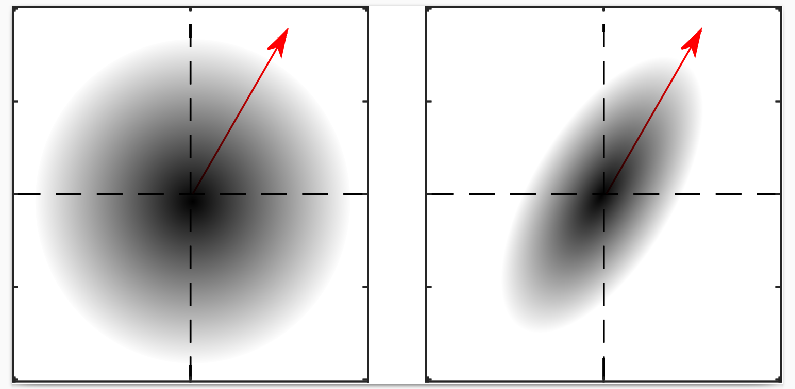

#  Anisotropic Wiener filter

    

This repository contains the code related to the anisotropic Wiener (AW) filter method for phase-aware audio source separation. AW is the topic of several research papers, that you're encouraged to check and to cite if you use the related content (see [below](#references)).

## Using this code

### Setup

Even though this code was primarly developed with Matlab, we've adapted it to Octave. To fully use it, you need several Octave packages, which we can install as follow:

	sudo apt install liboctave-dev
	sudo apt install octave-control
	sudo apt install octave-resample
	sudo apt install octave-statistics
	sudo apt install octave-dataframe	

Note that you can ignore `statistics` and `dataframe` if you don't intend to plot the results. This project also uses the [PEASS](https://hal.inria.fr/inria-00567152/document) toolbox for source separation evaluation, that you can download [here](https://gitlab.inria.fr/bass-db/peass) (remember to follow instructions and to compile it beforehand for faster computation).

The experiments use the [Dexmixing Secret Database (DSD100)](http://www.sisec17.audiolabs-erlangen.de/) for music separation. Download it, and unzip it in the `data` folder (or change the dataset path accordingly in the `global_setup.m` file).

### Reproducing the papers' results

This repository contains several general functions to benchmark certain algorithms and/or magnitude estimation scenarios. If you're only interested in reproducing a specific paper's results, we have created one script per paper that you can simply run for reproducing this paper (e.g., `icassp18.m` for our ICASSP 2018 paper). These scripts are simple in structure and consist of three main steps:
1. Learn the optimal hyperparameters on the development set.
2. Evaluate the considered algorithms on the test set (perform separation, record audio, and store the SDR/SIR/SAR).
3. Plot/display the results corresponding to images and/or tables in the paper.

If you want to skip step 1., then simply comment the corresponding line(s) in the script: the test function will use default values that correspond to these optimum.

Note that `icassp17.m`, `icassp18.m`, and `iwaenc18.m` perform separation into 4 stems (bass, drums, other, and vocals), while `waspaa17.m` performs singing voice separation.

Also note that the results might slightly differ from the papers:

- `icassp17.m` uses the scale-invariant SDR/SIR/SAR, while in the paper we used BSS Eval v3, which allows for frame-wise filters. The exact scores values are consequently not the same, but the comparison remains valid.

- `iwaenc18` plots the kappa as a function of Nw for all sources in the DSD100 dataset. In the paper, we only displayed it for guitar and piano, from different datasets (MAPS and ...). Here we only included DSD100 for simplicity.

### Everything at once

If you want to train and test all methods, you can simply run the main script `run_all.m`.

## Scenarios

Oracle
(true magnitudes)

Informed
Magnitudes estimated with NMF

## References

The results from this project have been published in the following papers:

- P. Magron, R. Badeau, B. David, [Phase-dependent anisotropic Gaussian model for audio source separation](https://hal.archives-ouvertes.fr/hal-01416355), Proc. IEEE ICASSP 2017.
- P. Magron, J. Le Roux, T. Virtanen, [Consistent anisotropic Wiener filtering for audio source separation](https://hal.archives-ouvertes.fr/hal-01593126), Proc. IEEE WASPAA 2017.
- P. Magron, T. Virtanen, [Bayesian anisotropic Gaussian model for audio source separation](https://hal.archives-ouvertes.fr/hal-01632081), Proc. IEEE ICASSP 2018.
- P. Magron, T. Virtanen, [On modeling the STFT phase of audio signals with the von Mises distribution](https://hal.archives-ouvertes.fr/hal-01763147), Proc. iWAENC 2018.

### Related projects

- [complex-isnmf](https://github.com/magronp/complex-isnmf) uses the anisotropic Gaussian model in conjunction with NMF modeling of the variance in order to perform joint magnitude and phase estimation.
- [complex-beta-nmf](https://github.com/magronp/complex-beta-nmf) extends the above by introducing beta-divergences in the inference process. It therefore generalizes complex NMF to any beta-divergence.
- [phase-madtwinnet](https://github.com/magronp/phase-madtwinnet) combines DNN-based magnitude estimation and phase recovery (using anisotropic Wiener filtering) for singing voice separation.
- [phase-hpss](https://github.com/magronp/phase-hpss) proposes a similar framework for harmonic-percussive source separation.

